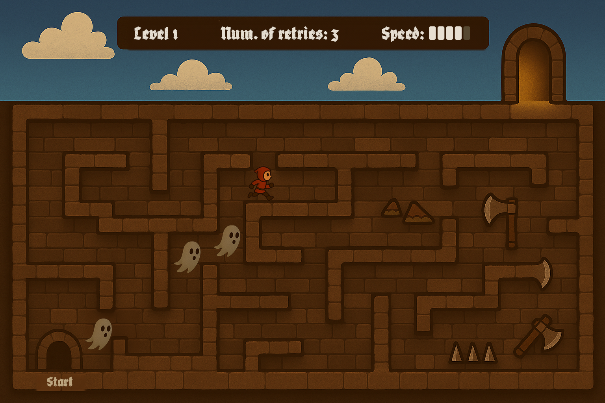

# Ghost Chase

**Name:** Yewon Kim  
**Student ID:** 20253158  
**Repository URL:** http://git.prototyping.id/20253158/homework5

---

## 📑 Table of Contents
1. [Game Concept & Mechanics](#1-game-concept--mechanics)
2. [Game Elements & Implementation](#2-game-elements--implementation)
3. [Expected Challenges](#3-expected-challenges)

---

## 1. Game Concept & Mechanics

**Ghost Chase** is a multiplayer maze attack game where two players **co-control** a single character to escape the maze (dungeon).

> “You’re not just escaping the maze. You’re escaping the traces of your past.”

### 🎯 Goal
- Solve the maze and reach the exit of the dungeon, avoiding obstacles.
- Avoid ghost clones that **replay your previous failed attempts**.
- Survive each level as new ghost clones stack up.

### 🕹️ Controls & Interactions

| Player | Controls       | Role                          |
|--------|----------------|-------------------------------|
| 1      | `A`, `W`, `D`   | Controls **direction**         |
| 2      | `→` to move, `↑/↓` to change speed ranging from 1~5 | Controls **movement and throttle** |

**Win Condition:**  
- Reach the exit before getting caught by any ghost.

**Lose Condition:**  
- Hit an obstacle, or collide with a ghost (your past self).

---

## 2. Game Elements & Implementation

### 🌐 Game World

- Bottom-up maze with walls and traps, ending with an exit to outside.
- One player icon, followed by its ghost clones (# of retries).
- UI overlays (level, # of retries, speed of player).
- Concept diagram:
  <p>
  
  </p>


### 🖼️ Reference Images

- Ghost Chase would resemble the logic and visuals of maze attack games like Pacman.

  <p>
  
  
  </p>

### 🔧 Architecture

#### 📦 Tentative Folder Structure

```plaintext
ghost-chase/
├── public/                   
│   └── index.html
├── src/
│   ├── components/           # Svelte UI components
│   │   ├── Canvas.svelte     # Imports game p5 sketch
│   │   └── HUD.svelte        # Level info, retries, speed
│   ├── game/                 # Game logic
│   │   ├── gameLoop.js       # Initialize, update and render game
│   │   ├── player.js         # Player input + drawing player sprite
│   │   ├── ghost.js          # Ghost clone management + drawing ghost sprite
│   │   ├── maze.js           # Maze structure + drawing
│   │   ├── controls.js       # Key mappings
│   │   └── recorder.js       # Records player path
│   ├── App.svelte            # Roots Svelte components
│   ├── main.js               
│   └── styles.css
├── package.json
├── vite.config.js            
└── README.md
```

#### 🧱 Modules and Libraries

- Each game module inside `/src/game/` encapsulates a single responsibility so that logic stays separated from the UI. 
- `Canvas.svelte` imports and orchestrates these modules through a p5 sketch loop (`setup`, `draw`), calling `gameLoop.js`, which delegates control to modules like `player.js`, `ghost.js`, and `maze.js`.
- UI state (level, # of retries, speed of player) is exposed via reactive Svelte stores and displayed using `HUD.svelte`.
- Libraries used:
  - **[`p5.js`](https://p5js.org/):** Rendering the maze, animations, and character movement  
  - **[`Svelte`](https://svelte.dev/):** Framework putting together UI components
  - **[`Ramda`](https://ramdajs.com/):** Functional utilities for ghost behavior composition, frame transformation pipelines, and immutable game state

#### 🌀 Recursive Function for Ghost Replay

To replay ghost movement, a recursive function steps through each stored frame:

```pseudo
function replayGhostPath(frameList):
    if frameList is empty:
        return

    set ghost state to first frame
    delay
    call replayGhostPath with remaining frames
```

This allows ghost clones to:

- Move in sync with past runs  
- Be layered recursively as the game progresses  
- Operate independently from player logic using stored frame data  

---

## 3. Expected Challenges

- Ghost logic: replaying previous frames accurately with recursive logic
- Collision and timing issues with multiple ghosts
- Handling performance/memory with repeated clone storage
- Keeping the gameplay balanced (not too easy or impossible after many retries)
- Syncing ghost position and player state updates cleanly in each frame
