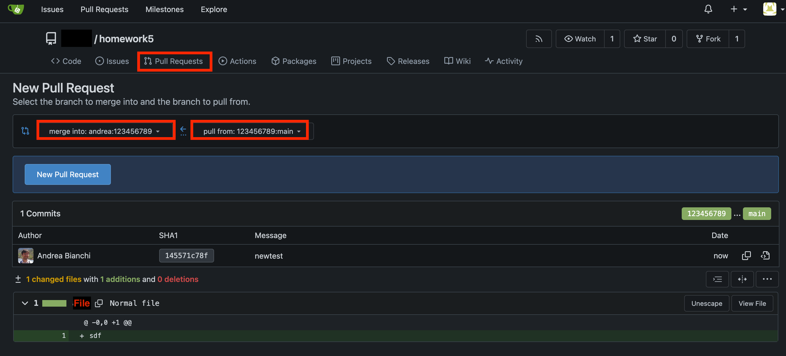

# Homework 5 - Writing with Markdown!

## General Description

The ultimate objective of this course is to enable you to create a project on your own. In this homework, you will _only_ write the **proposal** describing the implementation plan for your first project, using **[Markdown](https://www.markdownguide.org)** language. You will also learn how to do a **pull request**.

## About the project

The first project is _individual_. You will have to implement a **video game** of your choice (existing, or invented by you). You will have about _3 weeks_ (weeks 8-10) for implementing your code and documenting your project. The project will be demonstrated as a live or video demo and evaluated by the professor, the TA, and your colleagues (_peer-review_ evaluation).

> This proposal is _not binding_. This means that you can change your mind later. This is just a proposal for an idea, and I will provide in-class feedback, after which you can modify your goal.

For this project, you are encouraged to use libraries (e.g., p5.js or other libraries), online tutorials, or any material you can find (make sure to properly credit your sources in the documentation) but it is **not** required to explore material beyond those seen in class. A detailed explanation of how your project will be evaluated will be shared before the project starts.

## So, what do you have to do for this homework?

For this homework, you will have to write a **proposal** in English about the project you plan to implement. You should add several details and organize the document using the **Markdown** language.

## Instructions

Read carefully these steps.

1. **Fork** this repository. **Clone** your fork to your own computer.
2. Write in the `PROPOSAL_YOURID.md` file with a **description of your plan**. Substitute your ID with your actual ID, like for instance, if your ID is `12345` then the proposal document should be called `PROPOSAL_12345.md`.
3. Include the following in the proposal:
   - Add your **name**, **student ID**, and the **URL** to your forked online repository on [git.prototyping.id](http://git.prototyping.id) on the top of the file. This URL is based on your username.
   - **Describe the game** and the game mechanics - what does the user have to accomplish? How do you win or lose? What type of interactions are possible?
   - **How will the game look like?** What are the game elements (e.g. characters, world, interface) and how will they be implemented in code (e.g., modules, classes, objects, functions)? Feel free to use diagrams, flow-charts or any other visual representation to show your plan.
   - What do you expect to be the main **challenges**? What **features** taught in class do you expect to use in your implementation?
4. **Commit changes** to the `PROPOSAL_YOURID.md` file. **Push** changes to your repository. If you created a new branch different from main, you need to merge into `main`.
5. Create a **pull request** using the Gitea web interface from your account, targeting as destination `andrea:YOURID`. For example, if your ID is 1234567789 you should see a branch called `andrea:123456789`.
   
6. Submit the local folder using the class submission system (this is for redundancy purpose).

## About grading

This homework will be evaluated following two criteria:

1. **Details of the proposal content (50%)**. Include text and images to well explain what you plan to build. See the previous section for details.
2. **Quality of presentation (50%)**. Use **Markdown** to style and format the `PROPOSAL_YOURID.md` file to support clarity of communication and readability. Use 4 from the the following **Markdown** features:
   - images or tables
   - links to an external page, or to jump to different parts of the document
   - lists (numbered or bullet points)
   - headers, **bold** and _italic_
   - `backquotes` to show any pseudocode
   - table of content (you can autogenerate one using the [VSCode markdown extension](https://marketplace.visualstudio.com/items?itemName=yzhang.markdown-all-in-one))

## How to submit

1. **Fork** the original repo, **commit** your changes, and **push** them online. The crate a **pull request** as described above.
2. **Zip** the folder of this repository containing your proposal (`PROPOSAL.md` and this `README.md` file) and any additional file (e.g., images or others).
3. **Submit** the homework using the class [submission system](http://homework.designware.xyz). Choose `HW5`.
4. For any problem feel free to contact the professor or TA via Discord.

**NOTES**

- Only submissions made with the system will be considered (e.g., no direct emails to TA or Prof).
- You can re-submit as many times as you want: the last submission only will be considered.
- Submissions after the deadline (even a few minutes) will receive a penalty of 20%. Submissions submitted after 24 hours from the deadline will be ignored (score will be 0).
- Keep a screenshot that proves your completed submission.
- Writing style might be considered in grading
- Other subjective metrics by prof may apply
